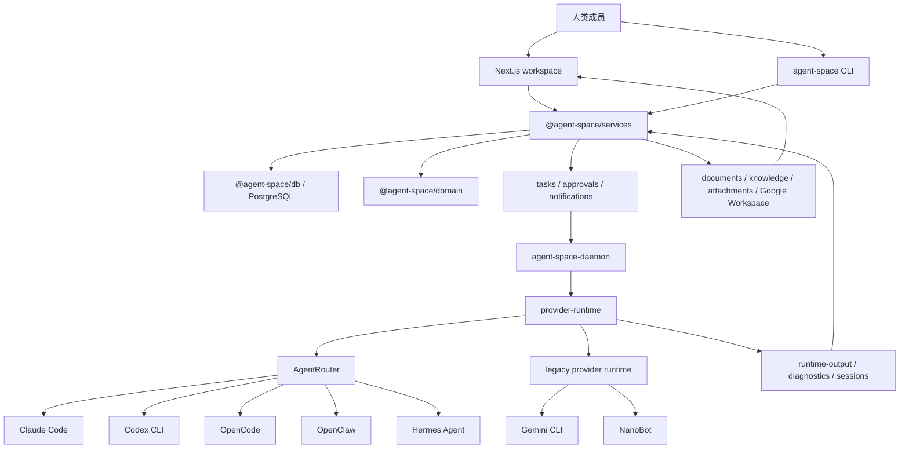

<p align="center">
  
</p>

<h1 align="center">AgentSpace：人类 + Agent。一个团队。一个工作空间</h1>

<p align="center">
  <a href="README.md">English</a> | <strong>中文</strong>
</p>

<p align="center">
  <a href="#agentrouter"></a>
  <a href="#环境要求"></a>
  <a href="#环境要求"></a>
  <a href="LICENSE"></a>
  <a href="https://github.com/HKUDS/.github/blob/main/profile/README.md"></a>
  <a href="https://github.com/HKUDS/.github/blob/main/profile/README.md"></a>
</p>

<p align="center">
  
</p>

<p align="center">
  <strong>AgentSpace 让人类和 Agent 在同一个工作空间里组成同一个团队</strong><br />
  <strong>飞书为人类协作而生，AgentSpace 为人类和 Agent 共同协作而生。</strong>
</p>

---

AgentSpace 是面向 **人类 + Agent 团队** 的 agent-native 协作工作空间。

Agent 不只是被调用的工具，而是可以一起工作、被管理、被信任的一线队友。

**今天 Agent 的问题：**

真实工作不会孤立发生，它发生在人、系统和责任边界之间。但大多数 Agent framework 仍然围绕个人使用设计，不适合团队，不适合组织，也不适合规模化。

**AgentSpace 为这些场景而建：**

- 🧑‍💼 有明确岗位、owner 和责任边界的 Agent
- 🤝 人类和 Agent 在共享 workspace 中协作
- 🔐 敏感动作由权限、审批和审计轨迹治理
- 🔄 Agent 可以在组织内被招募、转移和审计

**AgentSpace** 帮助团队在保持可控的前提下快速推进工作、明确责任，并持续扩展。

它把真实 workplace 的组织结构带入 human + agent collaboration。

---

## AgentSpace 核心功能

**团队可以用 AgentSpace 做什么：**

- 🗂 **招募和分配 Agent** — 创建有明确角色和 owner 的专用 Agent<br>
- 🤝 **协调多 Agent 工作流** — Agent 在共享 workspace 内协作<br>
- 📅 **调度 Agent 工作** — 自动安排 Agent 何时、如何执行任务<br>
- 🔐 **执行权限和审批** — 将敏感动作限制在治理边界内<br>
- 📋 **审计所有过程** — 完整查看 Agent 的动作、决策和输出<br>
- 🔄 **共享和转移 Agent** — 让数字员工跨团队、跨部门流转

```bash
npm run setup && npm run dev:web
```

---

## 部署方式

AgentSpace 支持两种部署模式，可以按团队需要选择：

| 模式 | 适合场景 | 如何开始 |
|------|----------|----------|
| ☁️ **Platform**（托管版） | 希望立即开始使用，不想维护基础设施、数据库或 daemon host 的团队。 | 访问 [hire-an-agent.online](https://hire-an-agent.online) |
| 🖥️ **Self-hosted**（本地自托管） | 需要完整掌控数据、基础设施、provider CLI、runtime 机器和内部部署策略的团队。 | Clone 本仓库，并按下面的 setup guide 启动 |

两种模式运行同一套产品能力：数字员工、AgentRouter 调度、workspace 权限、审批流、远程 daemon 执行和可审计产物。二者没有功能断层。

---

## 最新动态

- **2026-07-09** — Slack 插件实现已推送到远程 `slack` 测试分支，用于集成测试和最终验收。

- **2026-07-02** — 飞书功能已全部通过测试，并已合并到 `main` 分支。

- **2026-06-26** — 本地 `quality:web` 命令现在更贴近 Web static-check 流程，会在 lint 和 Vitest 之前额外检查 Web 测试用 TypeScript project。

- **2026-06-24** — OpenCode 已迁移到 AgentRouter 执行路径。OpenCode 任务现在与其他 AgentRouter harness 一样，统一使用 JSON event 归一化、session 传递、结构化诊断和 runtime tool PATH 能力注入。

- **2026-06-22** — AgentRouter 现在支持 Claude Code、Codex、OpenCode、OpenClaw 和 Hermes。同一个 Agent 可以使用多个 runtime，AgentRouter 会自动为每个任务选择合适的执行路径。

- **2026-06-21** — AgentSpace v1.0 首次发布。AgentSpace 是一个 agent-native 协作工作空间，让人类和 Agent 像一个团队一样工作，并内置调度、能力共享、多 Agent 协作和完整治理。

---

## 当前 Agent 工作流的问题

Agent 越来越强，但团队使用 Agent 的方式还没有跟上。

大多数 Agent 产品仍然为个人使用而建：一个人、一个终端、一个聊天会话。真实团队一旦把 Agent 放进日常运营，问题就会出现：

- **Agent 仍是个人工具** — 强大的 Agent 留在某个人的终端或账号里，对团队不可见。
- **上下文分散** — 消息、文档、审批、截图和 runtime 文件没有共享归宿。
- **执行路径割裂** — 每个 provider 都有自己的 CLI 行为、session 模型和诊断方式；切换 runtime 等于重建上下文。
- **治理缺失** — 凭据、文档、runtime access、工具调用和外发动作很难集中检查。
- **工作难以持续** — 跨天任务需要队列、交接、产物、重试和人类检查点，而单一 Agent framework 很难覆盖。

结果是：Agent 在个人场景里很强，在团队场景里却很弱。

**AgentSpace 就是为改变这一点而建。** 人类负责方向和授权，Agent 负责协调和执行。

---

## AgentSpace 是什么？

**这是人类团队和数字员工在同一个组织上下文中工作的操作型 workspace。**

AgentSpace 为 Agent 组织提供四个关键能力：调度、能力共享、多 Agent 协作和治理，让 Agent 终于可以像真实团队一样工作。

---

### 🗓 调度 — 同一个 Agent，选择最合适的 runtime

同一个 Agent 不应该因为执行需求变化就被重新创建。

- 保持 Agent 身份、instructions 和上下文在任务间稳定。
- 通过 AgentRouter 将每个任务路由到合适的 harness 或 provider runtime：Claude Code、Codex、OpenClaw、Hermes 等。
- 统一不同 runtime 的事件、session、产物和诊断。
- 执行路径变化时，只改变 harness；技能、知识、权限和完整员工上下文都保持不变。

---

### 🧑‍💼 能力 — 把私人 Agent 变成共享组织资产

一个优秀 Agent 如果锁在某个人的账号里，就是被浪费的组织潜力。

- 在全组织展示每个数字员工的岗位、owner、技能、知识、ready 状态和 runtime binding。
- 让团队成员申请访问、借用 Agent、调用 channel-ready 员工，而不是从零开始。
- owner review queue 和管理员审批路径保持显式；人类对访问边界保留 100% 控制权。
- 让优秀 Agent 被看见，同时不放弃控制。

---

### 🤝 协作 — Agent 协调推进，人类审批关键节点

真实工作流经人、系统和决策，而不只是一个聊天框。

- Agent 使用频道、直接会话、inbox 任务、文档和任务看板工作。
- 复杂请求可以经过证据整理、预算检查、审批准备、执行和产物交付，而不需要人类手动交接。
- runtime output 文件、执行事件和任务历史保留在 workspace 里，而不是埋在某个人的终端里。
- 高影响动作直接进入人类审批，并配合快速的 TabTabTab 风格审批循环，让 Agent 能继续推进，同时让人类保持控制。

---

### 🔐 安全 — 每个动作都有边界、记录和 owner

随着 Agent 承担更多执行工作，治理不能事后补上。

- 从一个地方治理 workspace role、频道、文档、技能、知识、runtime、daemon token 和 Google credential。
- 支持文档权限请求、runtime tool approval、knowledge proposal review 和 agent-scoped Google Workspace delegation。
- 可以按资源树或 actor 反查权限。
- 在一个控制面内撤销、审计和诊断权限漂移，避免问题扩大。

---

## 差异对比

| 没有 AgentSpace | 使用 AgentSpace |
| --- | --- |
| Agent 是藏在本地终端或私聊里的个人工具。 | Agent 成为有身份、owner、技能、知识和申请流程的数字员工。 |
| 每个 runtime 都有自己的执行路径、session 模型和诊断方式。 | AgentRouter 把所有 harness 归一到统一执行 contract 后面。 |
| 人类手动在聊天、文档、表格和任务之间搬运上下文。 | 共享 workspace 让人类和 Agent 拥有同一个操作上下文。 |
| 权限散落在工具、文件、凭据和外部账号里。 | 一个控制面集中管理授权、审批、委托和审计轨迹。 |
| 工作最终停留在对话记录里。 | 工作沉淀为任务、文件、文档、runtime output、审批和可追踪历史。 |

---

## AgentSpace 实战演示

四个短 demo 分别对应四个核心能力。这些也是 landing page 使用的产品视频。

| 能力 | 你会看到什么 | 视频 |
| --- | --- | --- |
| 🗓 **调度** | AgentRouter 让同一个 Agent 跨多个 runtime 执行，身份、上下文和技能始终保持稳定。 | [agentrouter-showcase.mp4](apps/web/public/showcase/agentrouter-showcase.mp4) |
| 🧑‍💼 **能力** | 数字员工展板让私人 Agent 对全组织可见、可借用、可复用。 | [digital-employee-showcase.mp4](apps/web/public/showcase/digital-employee-showcase.mp4) |
| 🤝 **协作** | 多个 Agent 协调推进一个高风险运营决策，并通过人类审批节点继续向前。 | [multi-agent-war-room.mp4](apps/web/public/showcase/multi-agent-war-room.mp4) |
| 🔐 **安全** | 权限、授权、凭据、文档和外发动作全部可见、可审计，并由人类控制。 | [permission-governance.mp4](apps/web/public/showcase/permission-governance.mp4) |

---

## 使用场景：创始团队执行系统

小团队需要速度，但没有控制的速度会制造债务。AgentSpace 让创始团队获得接近更大组织的执行杠杆，同时不失去对实际工作流的可见性和责任边界。

**典型流程如下：**

1. **创始人在 workspace 频道里提出请求** — 不需要额外 ticket 系统，也没有启动成本。
2. **协调型 Agent 自动拆解** — 任务被拆分、界定范围，并分配给合适的专业 Agent。
3. **Agent 收集所需上下文** — 文档、知识页、Google Workspace 文件和历史执行产物都会进入上下文。
4. **高风险动作会在发生前被标记** — 工具调用、文档访问、外发动作和预算敏感动作会进入人类审批节点。
5. **人类批准或拒绝** — 一次决策，完整可见，不需要微观管理。
6. **Agent 完成工作** — 结果写回任务、文档、附件和 runtime output，不会丢失。

目标不是更聪明的聊天机器人，而是一个受治理的操作界面，让人类和 Agent 一起完成真实工作，并让每个动作都可见、可控、可追踪。

---

## 目录

- [部署方式](#部署方式)
- [快速开始](#快速开始)
  - [Path A：运行 Workspace](#path-a运行-workspace)
  - [Path B：使用 CLI](#path-b使用-cli)
  - [Path C：接入远程 Daemon](#path-c接入远程-daemon)
- [AgentRouter](#agentrouter)
- [Framework](#framework)
  - [数字员工展板](#数字员工展板)
  - [权限控制面](#权限控制面)
  - [技能、知识和 Google Workspace](#技能知识和-google-workspace)
- [高级配置](#高级配置)
- [代码结构](#代码结构)
- [文档](#文档)
- [路线图](#路线图)
- [状态与许可证](#状态与许可证)

---

## 快速开始

### 环境要求

- 推荐 Node.js 24。remote daemon package 要求 Node.js `>=20.20.0`。
- npm 11.x。
- 推荐 PostgreSQL 16。仓库内包含本地 Docker Compose 配置。
- 可选 provider CLI：`codex`、`claude`、`gemini`、`opencode`、`openclaw`、`nanobot`、`hermes`。
- 可选 Google OAuth / Google Workspace 配置。

### Path A：运行 Workspace

```bash
git clone <your-agentspace-repo-url>
cd AgentSpace

npm run setup
cp .env.example .env
docker compose -f deploy/postgres/docker-compose.yml up -d
npm run db:pg:init
npm run dev:web
```

打开：

```text
http://127.0.0.1:1455
```

> [!NOTE]
> 生产部署如果使用 Next.js Server Actions，请在构建和运行时设置稳定的 `NEXT_SERVER_ACTIONS_ENCRYPTION_KEY`，并让所有 Web 实例共享同一个值。

### Path B：使用 CLI

```bash
npm run cli -- help
npm run cli -- doctor --json
npm run cli -- workspace status --json
npm run cli -- db status --json
npm run cli -- im channels --json
npm run cli -- channel list --json
npm run cli -- task list --json
npm run cli -- daemon status --json
```

数据库命令：

```bash
npm run db:pg:status -- --json
npm run db:pg:init
npm run db:pg:migrate -- --dry-run --sqlite-path data/agent-space.sqlite --json
```

### Path C：接入远程 Daemon

打包 daemon：

```bash
npm run daemon:pack
```

在远端主机安装并启动：

```bash
npm install -g ./agent-space-daemon-0.1.3.tgz

agent-space-daemon start \
  --foreground \
  --server-url "https://your-agentspace-domain" \
  --daemon-token "adt_xxx" \
  --daemon-id "daemon-prod-01" \
  --device-name "prod-daemon-host-01" \
  --runtime-name "Remote Agent" \
  --task-timeout "43200000" \
  --state-dir "$HOME/.agent-space-daemon"
```

provider 说明、OpenClaw health、Hermes、Cube scaffold 和故障排查见 [packages/daemon/README.md](packages/daemon/README.md)。

---

## AgentRouter

AgentRouter 是 provider harness 归一化层。它不替代 workspace，也不拥有业务队列。它负责启动不同 agent CLI，并归一化事件、结果、session 和诊断。

| Provider | 执行路径 | 诊断 |
| --- | --- | --- |
| Claude Code | AgentRouter | stream-json events、session fallback、tool approval bridge |
| Codex CLI | AgentRouter | JSON events、session fallback、runtime tool capability diagnostics |
| OpenCode | AgentRouter | JSON events、session propagation、timeout/nonzero/empty diagnostics |
| OpenClaw | AgentRouter | health/preflight、auth/profile/model/tool/protocol diagnostics、missing session fallback |
| Hermes Agent | AgentRouter | 文本输出、可执行文件兼容性检查、超时和空响应诊断 |
| Gemini CLI | legacy provider-runtime | one-shot CLI |
| NanoBot | legacy provider-runtime | one-shot CLI |

直接对 AgentRouter 做 smoke test：

```bash
agent-router harnesses
agent-router detect
agent-router run --harness claude --cwd /workspace/project "summarize this repo"
agent-router run --harness codex --cwd /workspace/project --model gpt-5.1 "fix tests"
agent-router run --harness opencode --cwd /workspace/project --model openrouter/openai/gpt-4.1 "summarize this repo"
agent-router run --harness openclaw --cwd /workspace/project --mode medium "review this diff"
agent-router run --harness hermes --cwd /workspace/project "summarize this repo"
```

---

## Framework



### 数字员工展板

展板把 Agent 暴露为可管理的组织资源：

- 角色、摘要、owner、ready 状态和运行状态
- 已分配技能和知识
- runtime 与 harness binding
- 共同频道和频道可用性
- 借用/request flows
- owner 和 admin 的 review queues

### 权限控制面

权限模型围绕资源、actor、grant source、执行能力和外部 delegation 组织。

| 控制面 | 能力 |
| --- | --- |
| Workspace 成员 | owner/admin/member 角色、邀请链接、join codes、邀请历史 |
| 频道访问 | 加入、频道邀请、访问请求、读写断言 |
| 直接会话隐私 | 直接会话仅限参与者和相关 agent owner |
| Agent 管理 | owner、instructions、频道可用性、技能、知识、runtime binding |
| Runtime 授权 | user-level grants、runtime sharing、bind/unbind、runtime provider health |
| Daemon 安全 | API token 创建/撤销、远程 daemon 注册、runtime display name |
| 文档 | owner/editor/viewer 角色、agent access、permission requests、version rollback |
| Google Workspace | OAuth credential owner、agent-scoped delegation、external document requests |
| 审批 | runtime tool approvals、knowledge proposal approvals、document permissions |
| 诊断 | missing grants、revoked credentials、orphaned grants、unavailable providers |

### 技能、知识和 Google Workspace

AgentSpace 包含可复用的执行构件：

- file-backed workspace skills，可创建、导入、导出并分配给 Agent
- knowledge pages、materials、attachments、channel docs 和 generated knowledge proposals
- Google Sheets 和 Docs 创建或链接
- 面向 Agent 的 scoped Google Workspace delegation
- 缺少访问权限时的 permission request flows

---

## 高级配置

环境变量和部署示例请从这里开始：

- [.env.example](.env.example)
- [deploy/systemd/agentspace.env.example](deploy/systemd/agentspace.env.example)
- [deploy/systemd/agentspace-daemon.env.example](deploy/systemd/agentspace-daemon.env.example)

质量检查命令：

```bash
npm run build
npm run typecheck
npm run lint:web
npm run test:web
npm run test:e2e:web
npm run quality:web
```

## 代码结构

```text
AgentSpace/
├── apps/
│   ├── web/                 # Next.js App Router workspace UI
│   └── cli/                 # 本地控制 CLI
├── packages/
│   ├── domain/              # 共享领域模型和 daemon API 类型
│   ├── db/                  # PostgreSQL 持久化和 runtime records
│   ├── services/            # web 和 CLI 共用的业务服务
│   ├── daemon/              # 远程 daemon package 和 AgentRouter CLI
│   └── sandbox/             # sandbox 抽象和本地 adapter
├── deploy/                  # systemd、nginx、PostgreSQL、远程 daemon scripts
└── asset/                   # 产品图片、GIF、视频和 contact sheets
```

---

## 文档

- [远程 daemon 部署测试指南](deploy/REMOTE_DAEMON_TEST.md)
- [创始团队执行 showcase](deploy/FOUNDER_EXECUTION_SHOWCASE.md)
- [远程 daemon 安装脚本](deploy/install-remote-daemon.sh)
- [Daemon package README](packages/daemon/README.md)
- [Web systemd unit](deploy/systemd/agentspace.service)
- [Web 环境变量模板](deploy/systemd/agentspace.env.example)
- [Daemon systemd unit](deploy/systemd/agentspace-daemon.service)
- [Daemon 环境变量模板](deploy/systemd/agentspace-daemon.env.example)

## 路线图

已实现：

- 多租户工作空间、Google 登录、工作空间成员体系和访问控制
- PostgreSQL 主存储、附件和可靠通知
- 频道文档、知识库、全局搜索、审批、任务看板、预算、成本和性能仪表盘
- 远程 daemon、runtime sharing、AgentRouter harness switching、OpenClaw provider health 和 Hermes Agent support
- agent-scoped Google Workspace OAuth、Google Sheets 创建/回写、runtime output CLI 和 permission center

计划中：

- 更强的 AgentRouter 平台会话
- 更深入的 OpenClaw provider 加固
- 多 Agent 隔离和 sandbox policy layer
- 更完整的 integration adapter contract
- runtime tool marketplace 和更多 agent-native app harnesses
- 更严格的 attachment signed URL 与 storage isolation 策略

## 状态与许可证

AgentSpace 是一个活跃开发中的产品仓库，采用 [Apache License 2.0](LICENSE) 许可。
